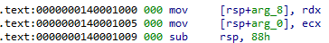
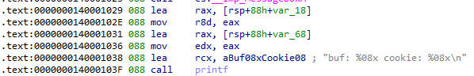
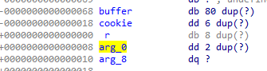
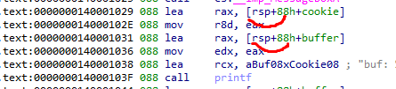
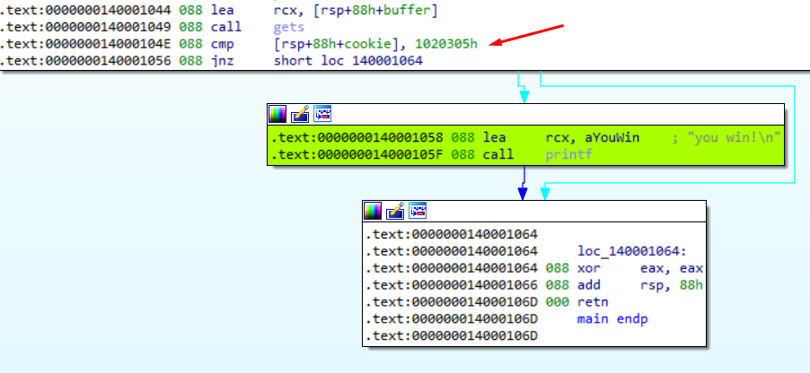
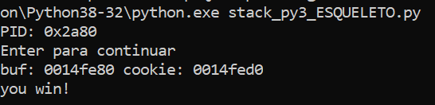

**stack2_x64.exe**

In the previous exercise we saw that to reach the message "**you win!"** We had to overwrite the RET to jump into that block.

Well, in this other exercise the binary is compiled in 64 bits, so we will have to use the **IDA x64**

In **x64** architecture the first 4 arguments are passed in the **RCX, RDX, R8, R9** registers**,** while the rest are passed through the stack.

However, the MOV instruction is used instead of the **PUSH** to prepare the stack.

We see that this is so, and **0x88 (136)** bytes are reserved.

We have the MessageBox and then the addresses of the **buffer** and **cookie** variables are printed**.**

We rename the variables, var_68  to **buffer**, and var_18 to **cookie**.

This is the stack, the first thing that strikes me is that we do not have the **s (the base pointer)**

To access the variables the **rsp** register is used.

Note that the **gets** function receives a pointer to the beginning of the **buffer** variable**,** to which we can overflow and overwrite the content of the **cookie** or **return.**

****

The cookie is compared against **0x1020305**

In **little endian** this would be **05 03 02 01 00 00 00 00**

My Python Script would look like this:

| import sys from subprocess import Popen, PIPE  buffer = b"A" \* 80 cookie = b"\\x05\\x03\\x02\\x01\\x00\\x00\\x00\\x00"  payload = buffer + cookie  p1 = Popen("STACK_2_64.exe", stdin=PIPE) print ("PID: %s" % hex(p1.pid)) print ("Enter para continuar")  p1.communicate(payload) p1.wait() input() |
|--------------------------------------------------------------------------------------------------------------------------------------------------------------------------------------------------------------------------------------------------------------------------------------------------------|

****

References:

-   [IDA64](https://book.huihoo.com/reverse-engineering-for-beginners/reverse-engineering-for-beginners-en-a5.pdf)
-   [Register_and_Instruction_Quick_Start](https://wiki.cdot.senecacollege.ca/wiki/X86_64_Register_and_Instruction_Quick_Start)
