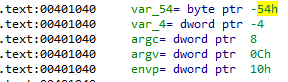

When you open the **STACK1_VS_2017**.**exe** on **IDA**  the first thing you see is the **Prologue** of the function.

Here the old base pointer of some previous routine is pushed**,** and then the new base pointer  of this function is fixed. The memory space that will be needed is reserved, it is **0x54 (84) bytes**.

We know that when entering a function, the return address is pushed **,** so the stack will look like this:

**EBP** that is now the **new base pointer** is fixed, and will serve to point to the **local variables**, and move through the **stack frame** for whatever is necessary.

**IDA,** when entering a function shows us at the beginning the declaration of variables and the arguments.

There it shows us the offset in the stack where they will be located, we put this data on a table, and it looks like this:

The same thing is already done by **IDA** automatically if we double click on any **local variable** it will send us to the stack window.

On the image below, we can see that the size of the variable **var_54** is **0x50 (80) bytes**, we can convert it into an **array** to see it better

**IDA** automatically calculates the size of this variable, which is **0x80** bytes.

now we can see it better on the stack window

Let’s rename **var_54** to **buffer**, and **var_4 we**  will call it **cookie**, to do this we stand on the variable and press the **N key**, or choose **rename** from the menu

which unfolds with a right click.

Continuing with the analysis, we see that a **MessageBox** appears that we must accept in order to continue, and then, a message is printed in the console with the addresses of the variables **buffer** and **cookie**.

****

It then pushes a pointer to the beginning of the **buffer** variable  that is passed as an argument to the gets() function**.**

Finally it is fixed if the **variable coockie** is equal to 0x41424444, in case it is equal then it will show the message:  **"you win!"**

Otherwise the program will end up doing nothing.

Very well, let's remember how we had the stack:

The **gets**  function does not check the buffer length. We can take advantage of this and overflow  the **buffer** variable to step on the **cookie variable**  with the **0x41424344** value**.**

Then we will send 80 bytes plus the cookie value: 0x41424344.

My python script to exploit this exercise is as follows:

| import sys from subprocess import Popen, PIPE  buffer = b"A" \* 80 cookie = b"\\x44\\x43\\x42\\x41"  payload = buffer + cookie  p1 = Popen("STACK1_VS_2017.exe", stdin=PIPE) print ("PID: %s" % hex(p1.pid)) print ("Enter para continuar")  p1.communicate(payload) p1.wait() input() |
|----------------------------------------------------------------------------------------------------------------------------------------------------------------------------------------------------------------------------------------------------------------------------------------|

Once you accept the messagebox you’ll see the **"you win!"** message

****
