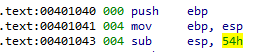
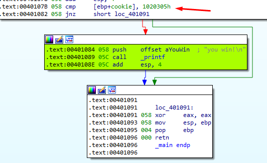
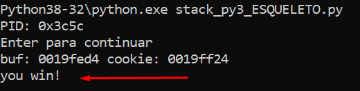

Now that we have solved the first exercise [01 Stack Nro 1](https://docs.google.com/document/d/1s28WppAv2U55NWb4uhFO55tlA0ORz4FjiG1deznUwkI/edit?usp=sharing) we can move on to this second **STACK2_VS_2017**.exe.

As in the previous exercise, at the beginning of the function, 0x54 (84) bytes are reserved to be used by local variables, etc.

There is also a MessageBox that we must accept so that a message with the buffer and cookie addresses is then printed on the console**.**

A pointer is then passed as an argument at the beginning of the variable **var_54** to the gets function**.** Let's rename this variable as **buffer,** I stand up and press the **N** key to rename it.

The only thing that changes here is the value against which the **cookie** is compared, it is now **0x01020305**

My python script would look like this:

import sys

from subprocess import Popen, PIPE

| buffer = b"A" \* 80 cookie = b"\\x05\\x03\\x02\\x01"  payload = buffer + cookie  p1 = Popen("STACK2_VS_2017.exe", stdin=PIPE) print ("PID: %s" % hex(p1.pid)) print ("Enter para continuar")  p1.communicate(payload) p1.wait() input() |
|-----------------------------------------------------------------------------------------------------------------------------------------------------------------------------------------------------------------------------------------|

****
