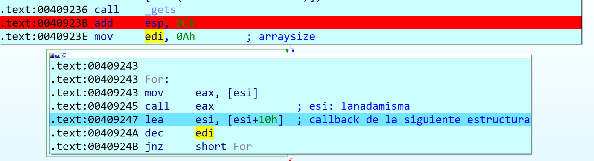
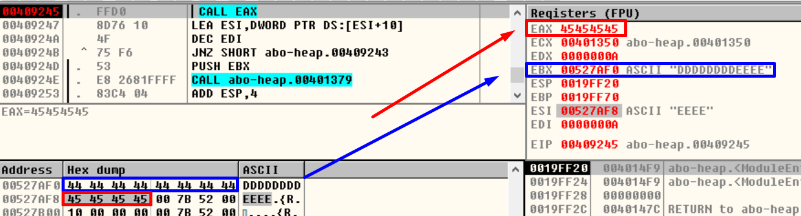

**abo-heap-overflow.exe**

Let’s open this **ABO** with the **IDA** and set a **BP** right after the \_**gets** function:

****

Press  (or F9) and enter "21212121", press ENTER and IDA stops at the Breakpoint

In the **EAX** register and at the top of the **STACK** we can see the memory address where the entered number was stored.

It is stored in a memory space that was dynamically allocated.

**Sizeof** returns the number of bytes in a structure, variable or data type. In this case we see a **sizeof**(**DWORD**) that would return **4 bytes**, this is multiplied by **arraysize** which equals **10**, so the final result would be **40 bytes**.

This is allocating memory for **40 DWORDs**, that is, **40 \* 4 bytes of a dword = 160 bytes.**

When executing the **new** function in **EAX** we will have the pointer to the reserved memory space. Since we have the code we know that it is stored in **\*dwordarray**.

The **new** operator is used to reserve dynamic memory, similar to the **malloc** function. **This operator allows you to create an object of any type, and returns a pointer to the created object.**

Memory allocated with **new** will be valid until it is freed with delete or until the end of the program, although it is advisable to always free memory allocated with new using delete. It is considered a very suspicious practice not to do so.

Then more memory is requested:

| somestruct \*structarray = new somestruct[arraysize]; |
|-------------------------------------------------------|

There we see that it asks for memory for **160 bytes**, the product of multiplying the **arraysize** with the total bytes that the **somestruct** structure has.

| typedef struct somestruct {  DWORD size;  DWORD location;  DWORD callback;  DWORD next; } somestruct; |
|-------------------------------------------------------------------------------------------------------|

There are **4 dwords**, that is, **16** bytes. **Arraysize** is worth **10** and multiplying it by **16** gives **160.**

On this second occasion we know that it stores the pointer in the variable **\*structarray.**

****

I have created this structure in **IDA**, I am not going to explain how to create them but a good read where they explain it is in Ricardo's course, C and REVERSING (part 7) by Ricnar.doc

Then we know that in **ebx** I'm pointing to the beginning of this structure, so we position ourselves for example **[ebx+4]** and press the **T** key, choose our structure and hit enter, and so on. We're going to get something like this:

The **callback** receives the pointer of a function called **lanadamisma**

The structure **structarray** is filled with data as seen in the image above. This structure is located below the **dwordarray**.

The **dwordarray** will be filled with the data we have entered and captured with the **gets** function.

|  gets((char \*)dwordarray); |
|-----------------------------|

Then, it obtains the address of the function **lanadamisma** through the **callback** that was previously stored in **ESI**.

Our goal will be overwriting the content of the **callback** with an address that points to our **shellcode** that executes the calculator.

To summarize, we know that **dwordarray** has a size of **160 bytes** and there’s **24 junk bytes** between **dwordarray** and **structarray**, and there are another **8 bytes** up to the **callback** in the first structure in the array.

Let’s try entering 160 + 24 + 8 characters after **gets**.

****

Standing over the **call eax** instruction, we can see that **eax** contains the address of the pointer where we want to jump to, **ebx** contains a pointer to the **shellcode**, but we only have **8 bytes**.

****

On the other hand, we found the pointer at the beginning of our **shellcode** in **ESP – 0xC**.

Then, the first thing we need to do is jump to **ebx**, for that, we search the code for a **call ebx**, for example, the one in the **406831** address.

****

Now we need to jump to this **call ebx**, to do that, we will use the **call eax** we are standing in, and make it so **eax** points to **call ebx**, so we will have to put this pointer at the end of the **shellcode**.

Once we are in the **call ebx** we will have reached our **shellcode**. In the stack we can see that **esp-4** is pointing to the start of our **shellcode**.

We can use these **8 bytes** to write:

| sub esp,4 retn |
|----------------|

With the first line, we are standing on the **shellcode** in the stack, and we jump to it with **retn**.

Referencias:

-   [Función sizeof](http://www.it.uc3m.es/pbasanta/asng/course_notes/ch06s04.html)
-   [Función sizeof(dword)](http://download.mikroe.com/documents/compilers/mikropascal/pic/help/sizeof_operator.htm)
-   [Función new](https://www.zator.com/Cpp/E4_9_20.htm)
-   [Función new](http://conclase.net/c/curso/cap13)
-   C Y REVERSING (parte 7) por Ricnar.doc
-   
