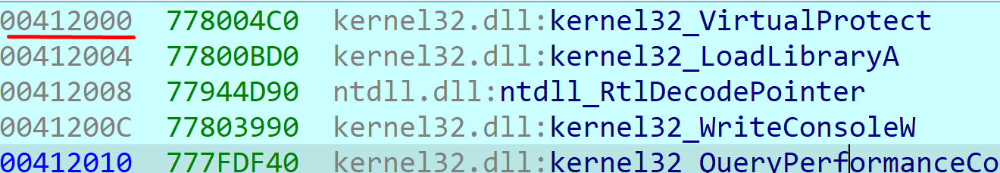

**abo1_nx.exe**

This exercise adds a mitigation called **DEP** (data execution prevention) that only allows code to be executed in the code section of the executable, unlike the other exercises in which we could execute code in the Stack or the heap or in another section other than the code section.

We open the **ABOX** in **IDA**, the main thing we see here is that there is a function **(_fn**) that receives as a parameter an integer 1.

And inside this **fn**() we see a local variable **buf**, plus the argument **arg_1** that was passed as a parameter.

**buf** has a size of **0x400 (1024) bytes**

****

Then load a library **nsvcrt.dll** using LoadLibraryA()

****

It also calls **VirtualProtect**(), which is a system function that allows you to change permissions to sections of an executable's memory.

We also found that it uses the **gets_s()** function which is used to capture the text entered by console but unlike **gets**(), it has a security improvement since it adds an argument which is the maximum number of characters it can store.

| char \*gets_s(  char \*buffer,  size_t sizeInCharacters ); |
|------------------------------------------------------------|

In this case the maximum number of characters stored in the buffer will be 0x4e20

As we see in the image below, we can overwrite the return address, because the number of bytes that can be saved with the **gets_s** function is greater than the buffer reserved for that purpose

**buffer size = 1024 (0x400)**

**maximum characters to receive: 20000 (0x4e20)**

But in order to execute our shellcode we must first give the stack execution permission, since due to the DEP we will not be able to execute in this area. To do this we will use the **VirtualProtect()** system function with the **ROP** technique to achieve our goal. [DEP y ROP](https://docs.google.com/document/d/1OatMNN7Q0QbMUpbaKk67raUxB-fOjsGf9_qFvBtMSbM/edit?usp=sharing)

So we must set the registers before the final jump to our shellcode through a **PUSHAD – RET**

EDX=**040** \#new protect

ECX=**0x10000** \#writable pointer

EDI= pointer to **RET**

EBX=**1** \#size

ESI= pointer to **VirtualProtect**

EBP= pointer to **JMP ESP**

These will be the argumentos of **VirtualProtect.**  And all of them will be controlled by us since we send them through the console and with the gets_s the program will save them in the buffer (stack)

Now we need to find the gadgets that allow us to set the registers as we just saw, to do this we look among the modules that our executable has loaded, for one that does not have randomization so that the addresses are always the same and thus our code is reliable, we find that the module that our program had loaded at the beginning (nsvcrt.dll) meets that requirement, so we will look for the gadgets there

****

Setting the arguments of **VirtualProtect**():

To put the value 40 in edx we need a gadget that is: pop edx, ret.

****

The rest of the registers are set with **pop** gadgets that we find in the code

remaining in this way:

**ESI** contains the address of the **IAT** pointing to **VirtualProtect()**

****

Now I will use the **mov eax, esi - pop esi - ret** gadget to set the VirtualProtect address in the **ESI** register

Now that we have the pointer to VirtualProtect in EAX we need to find a gadget that does **mov eax, [eax]** to set EAX with the address of the function

Finally to move the VirtualProtect address we have in EAX to this, find this gadget: push eax - add al, 5fh - pop esi – retn

****

Finally, we will look for a gadget that does: pushad - ret

This will place all the registers on the stack and will end up executing the JMP ESP. Note that this jump will take us just above the bytes that are in EAX, so it will be necessary to change that value using a gadget that does pop eax and leaves the bytes 90909090 (nop) and thus avoid a crash.

****

Finally we can execute the gadget **pushad / retn**

****

At the end of all this code and if everything went well, the VirtualProtect function will have changed the stack permissions and now we can execute the shellcode.

This is the script:

