**ABO3_VS_2017.exe**

In the function prologue, reserve **0x104 bytes** for the **buf** and **fn** variables.

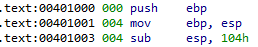

We also observe that it uses the vulnerable function **gets()**, which receives the variable **buf** as a parameter.

**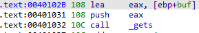**

The variable **fn** receives as a parameter a pointer to the **puts**() function

**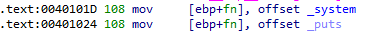**

And then call the **fn** function

**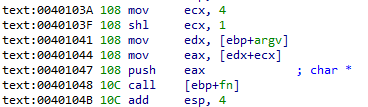**

The **fn()** function does the following: First it moves the value 4 to **ecx** and does **shl** with 1, which is equivalent to multiplying it x 2, giving **8** as a result.

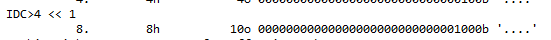

And this value will be used as an index for the list of arguments (corresponds to **argv[2]**) that will be stored in **eax**

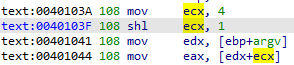

Finally, it uses that value as an argument to call the **puts()** function.

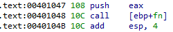

Terminando con la función **exit**, así que no vamos a poder pisar el **ret** en este caso.

Ok, so far we know that **abo** takes two parameters, **argv[1]** and **argv[2].**

So, we send it two strings, **“aaaa”** and **“bbbb”**, when we hit enter, it will pause so we introduce **“cccc”** that it will take with the **gets()** when we hit enter, and finally it prints **argv[2]** on the screen.

**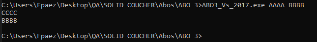**

This is the arrangement of the variables in the **stack** frame

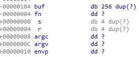

The idea is to overwrite the pointer in the variable **fn**, we will achieve this by overflowing the variable **buf**.

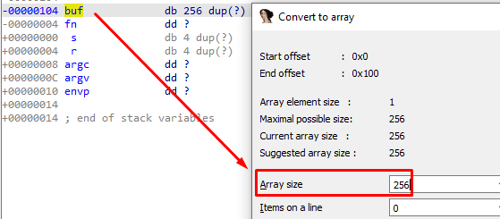

We need 0x100 bytes to fill the buffer and with 4 more bytes we overwrite **fn**

The **fn** function uses as a parameter the **EAX** register which is controlled by us with the second argument (**argv[2]**)

**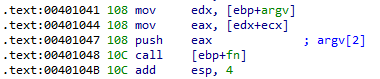**

So the idea would be like this:

1\. We overflow the variable **buf** to overwrite the pointer of the variable **fn**

2\. overwrite this pointer with the address of some **CALL EAX** or **Push eax/ret,** or some **jmp eax.**

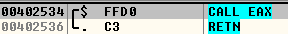

Ok, this didn't work because the payload has invalid characters so we'll have to find another solution.

Looking carefully at the code we realize that we have the address of **\_system**, this is good news, because we could use that address to overwrite the pointer with it and thus directly execute the calculator.

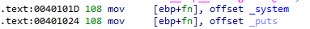

The **\_system** function is used to execute subprocesses or operating system commands.

Then we can pass the string **calc** in the second argument (**argv[2]**) so that it then calls **fn** (\_**system**) and thus executes the calculator.

**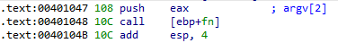**

We have to overwrite the **fn** pointer with the address of \_**system**

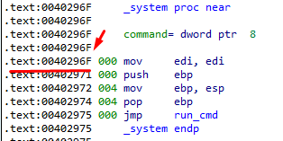

In summary, what we did was replace the **puts** address with the \_**system** address, taking advantage of the overflow.

| import sys from subprocess import Popen, PIPE  buff = b"C" \* 0x100 \# Buffer  argv1 = "AAAA" argv2 = "calc" pointer_fn = b"\\x6F\\x29\\x40\\x00" \# \_system payload = buff + pointer_fn   p1 = Popen("ABO3_VS_2017.exe " + argv1 + " " + argv2, stdin=PIPE) print ("PID: %s" % hex(p1.pid)) print ("Enter para continuar")  p1.communicate(payload) p1.wait() input() |
|-------------------------------------------------------------------------------------------------------------------------------------------------------------------------------------------------------------------------------------------------------------------------------------------------------------------------------------------------------------------------|

**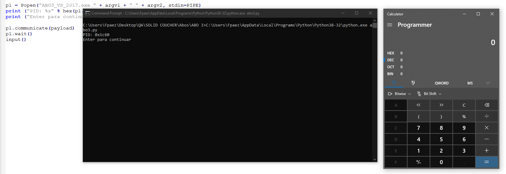**
