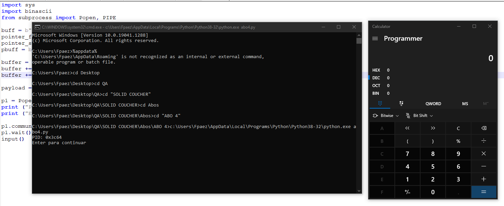

**ABO4_VS_2017.exe**

In this **abo** we have 2 variables, a **buffer** and a pointer to another **pbuf** buffer that is created with the **malloc** function. The buffer that **pbuf** points to is **0x64 (100) bytes** in size

We also see a **global variable fn**, we know it's **global** because it's defined in the **DATA section**

****

The **global variable fn**  is initialized with the **pointer** to the puts function **,** and since it **is not** a local variable then it does not take up space on the **stack.** All accesses to it are not through the stack, but directly from the memory of the **process**.

****

The **buf** variable is going to be filled with the data that we enter by keyboard.

Then fill the second **buffer** pointed by **pbuf**

This second buffer was created with **malloc(),** which is a function used to allocate a block of memory in the **heap**. The program accesses this block of memory through a pointer that **malloc** returns in the **EAX** register. When the memory is no longer needed, the pointer is passed to the **free** function, which frees up the memory so that it can be used for other purposes.

Finally, it executes the **fn** function that originally contained the direction of the **puts()** function, and what it does is print the contents of **buf on the screen**

Now let's look at the arrangement of the variables in the stack

Note that in the code there is still the **system**  function located at the address **0x402657** this can be useful to us.

****

So it occurred to me again to do the same thing as in the **ABO3**, that is, to run the calculator with the **system function**

Originally **\_fn** points to the **system function,** just before the address of the **put is assigned.**

****

We can check it by double-clicking on **\_fn**

Let's look at the **Hex View window**

The content of **0x00415000 (_fn)** is **0x00402657 (system)**

****

**pbuf**  is used as an **argument** in the **second gets**, so with the **first gets** we could step on the **pbuf** pointer **,** making it point to **0x00415000 (_fn).**

Then he uses **pbuf,** which now aims to **\_fn,**  as the argument of the **second gets.**

****

So to point to **system**  again we must send it the address **0x00402657 (system)** by keyboard

****

In this case, as there are two **gets**, in the **python**  script we have to end in the first one with a carriage return (**"\\n")**

The script:

| import sys import binascii from subprocess import Popen, PIPE  buff = b"calc" + b"\\x00"  pointer_fn = b"\\x00\\x50\\x41\\x00" \# funcion \_fn pointer_system = b"\\x57\\x26\\x40\\x00" \# funcion system pbuff = b"\\x90" \* 4  buffer = buff + b"A" \* (0x100 - len(buff)) buffer += pointer_fn + b"\\n" buffer += pointer_system  payload = buffer  p1 = Popen("ABO4_VS_2017.exe", stdin=PIPE) print ("PID: %s" % hex(p1.pid)) print ("Enter para continuar")  p1.communicate(payload) p1.wait() input() |
|-------------------------------------------------------------------------------------------------------------------------------------------------------------------------------------------------------------------------------------------------------------------------------------------------------------------------------------------------------------------------------------------------------------------------------------------------------------------------------------------------------------|

