**Abo-sp.exe**

We run the **Abo** and notice that it is a server that is listening on port 65535

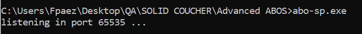

Observing with Process Hacker, we noticed that it loads a proprietary library called Trapecio.dll

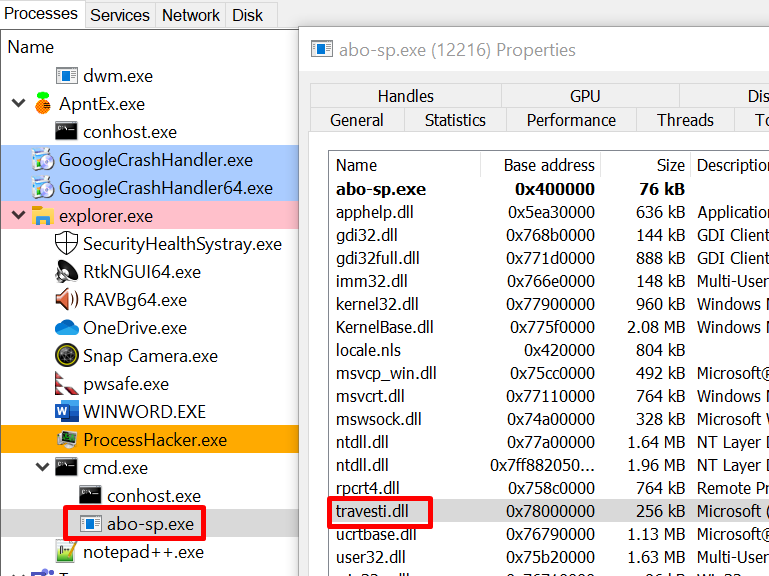

We open the Abo in IDA to see the Main() function

After loading the library, call to **VirtualProtect()** to change the permission of the global variable **buf**, leaving it with **PAGE_READWRITE**, meaning it will not have execution permission.

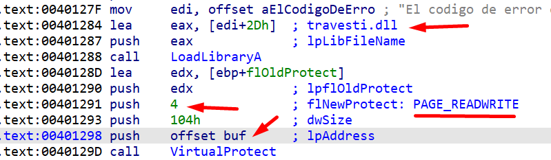

Double-clicking on the **buf** variable we notice that it is in the **data** section, which corresponds to a **global variable** and has a size of **256 bytes (0x100).**

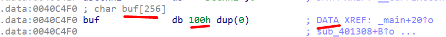

Since this is a server that will receive data via socket, let's look at the **recv()** function to see if we can figure out what's going on.

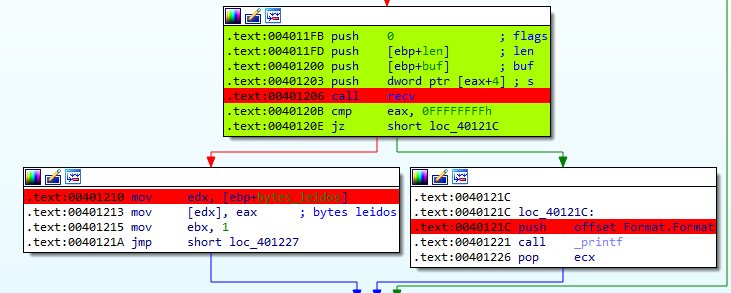

We can see that it receives the data in the **buf** variable, then it will return in EAX the number of bytes read and it will save that in the variable that it renamed to bytes_leidos

We look for references to know from where the recv function is called and we see that it does so from 2 different places.

The function is called from 2 different places, let's see the first one

comes from this block that starts by doing **memset** to fill the buffer (buf) with 0

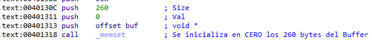

There is something striking here, because the buffer has a size of 256, however when calling memset to initialize the buffer with 0, it uses 260 as size, (0x104) that is, 4 more.

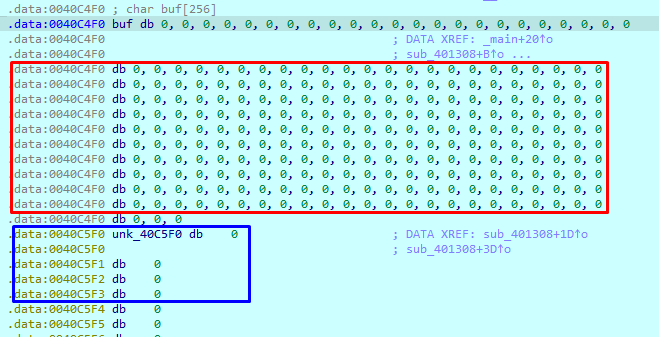

This buffer is where the data that we send by socket will be received, in this case I have sent all “A”

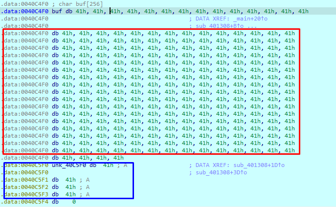

Next, a pointer to the **printf()** function is stored next to the 256-byte buffer. All of this happens before calling the **recv()**

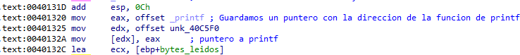

Since the **recv()** function receives 0x104 bytes (260), we can overwrite the next dword of the **buf** variable which had a size of 0x100 (256), this dword originally contained the pointer to **printf()**

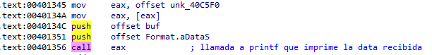

We can control those 4 bytes by placing an address that contains a **CALL EAX**, but that memory area does not have execution permission since it was changed at the beginning.

The conventional solution would be to do ROP, we have the Trapecio.dll library where we can search for gadgets, but there is a simpler solution. We can try to copy the contents of the **buf** variable to some other memory area that already has execution permissions, for this we would use the **memcpy()** function at 0x402458

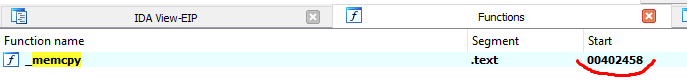

This function has 3 parameters: Destination, source and number of bytes to copy.

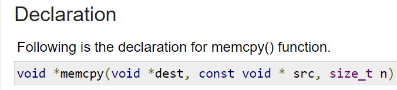

We must leave the stack prepared with the arguments to execute the CALL EAX that will end up executing memcpy, with the address of the buf where our data is, which will be the source, and we can use 0x40a115 as the destination. We also have 0x104, which would be the number of bytes to copy.

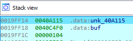

We will send all this data in the first packet and then we will have to send a second packet to execute our shellcode, for this the CALL EAX must contain the destination address where we copy our data sent in the first packet.

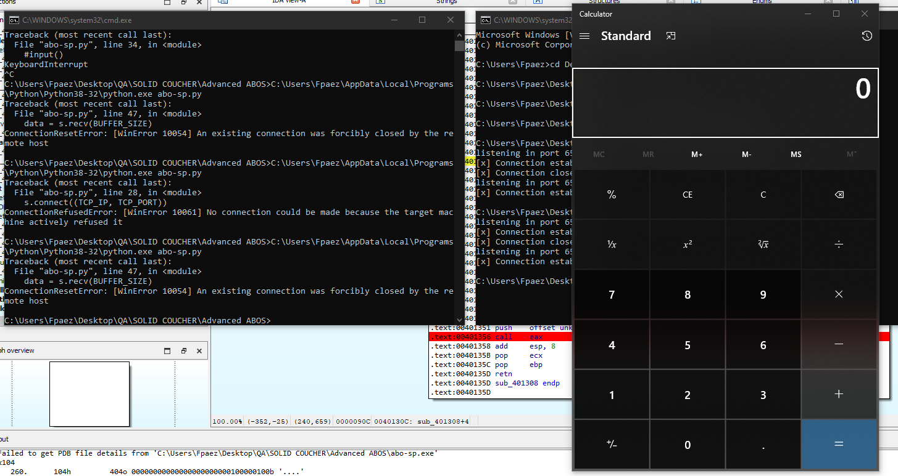

The script:

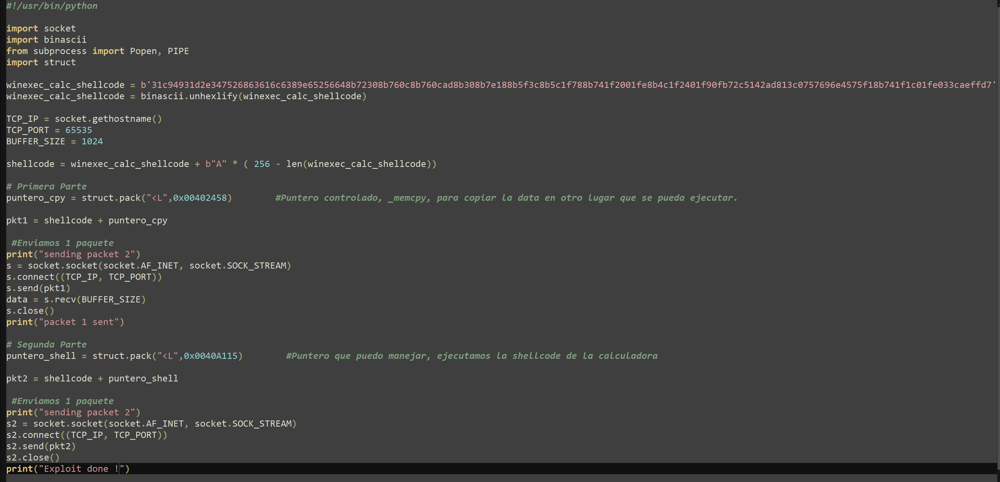
