**AboR1.exe**

We move on to the remote ABO's. (AboR1.exe) We run it from the cmd and we can see the following:

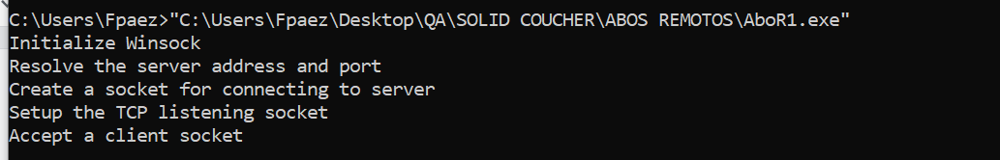

With the process hacker tool we can see that it is a server that is listening on port **27015**

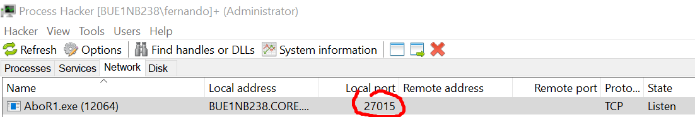

The **recv** function is used to receive data sent through a socket.

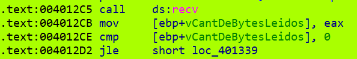

Then it will print on the console the number of bytes received and check that they are more than 4

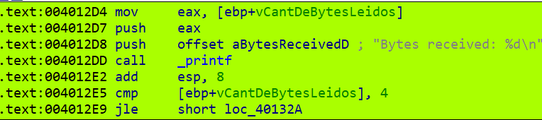

The first 4 bytes are compared with **0xCAFECAFE**

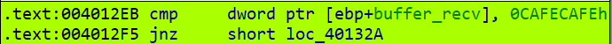

If they are not equal, the program does not continue, so we must send those first 4 bytes to be able to continue, and get the **“valid cookie!”** message.

**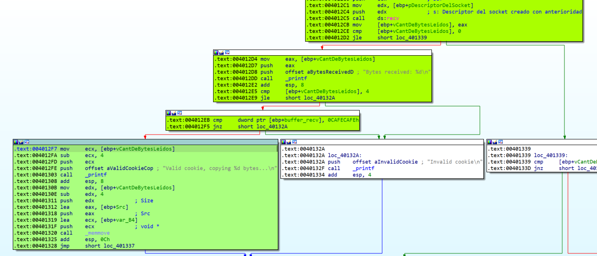**

The **buffer_data** variable has a size of 128 bytes, and will be the destination buffer where the bytes we send to the server (that receives up to 1024 bytes (**buffer_recv**)) will be copied. Then the **memmove()** function will copy the amount of bytes received into the **buffer_data** variable, thus being able to overflow it and overwrite the return address to control the flow of the program.

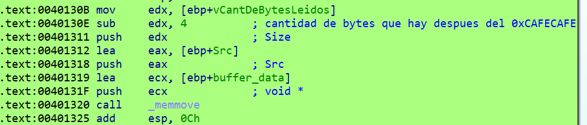

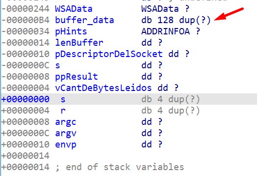

We will overwrite the return address with a **JMP ESP**

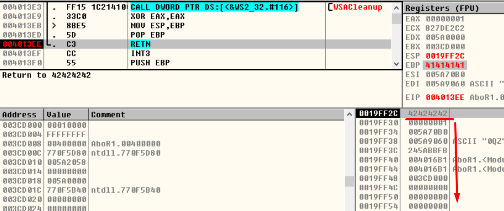

La forma que encontré de saltar a la **shellcode** es a traves de un **jmp esp**, la cual lo encontramos aquí:

And at the end of the **JMP ESP** address we send the shellcode to run the calculator

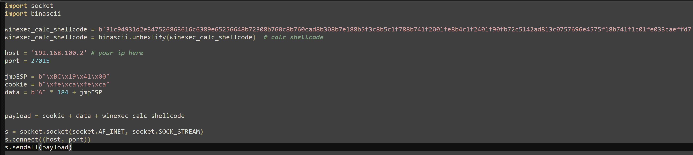

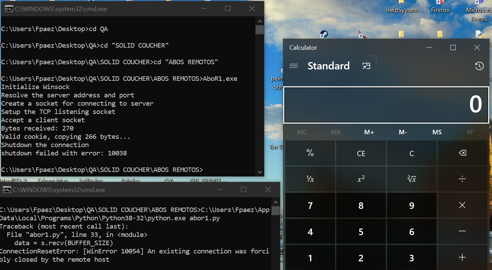
