**AboR2.exe**

It is the turn of the second level of remote ABO's, in this case **Abor2**

Unlike the previous level, when executed this one does not print any message on the console.

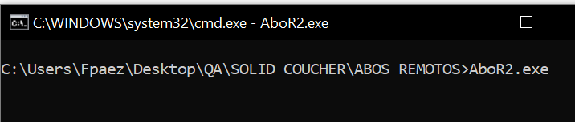

We use the Process Hacker tool to see which port it is listening on, although we could also do it manually.**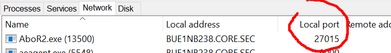**

This is what the flowchart looks like in **IDA**

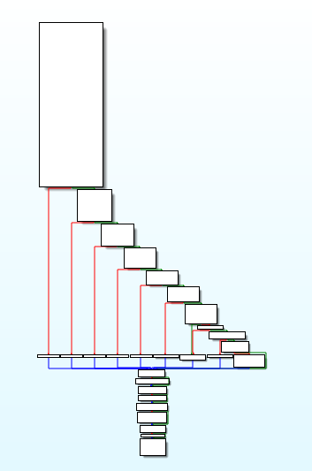

In this line of code the program will receive the data that we send to the server, using the **recv()** function

Then it checks that more than 8 bytes are sent, otherwise it exits

**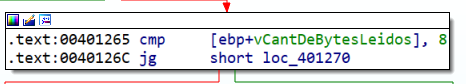**

The first 4 bytes are compared with **0xCAFECAFE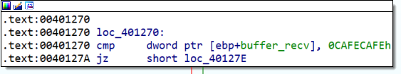**

Then below we have the **memcpy** function that copied the received bytes into the **var_88** buffer

But before copying, it compares that the size (controlled by us and corresponding to the fifth byte sent) is less than 0x64, and if it is greater, avoid the block that makes the memcpy

**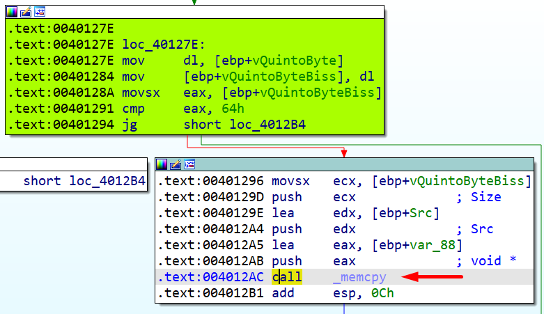**

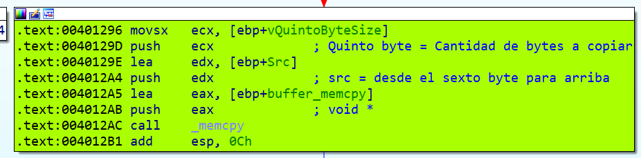

Looking at the stack frame I can calculate how many bytes I would need to produce an overflow and override the return address, but in this case overriding the return address is useless since the program has a mitigation (security cookie) that checks the integrity of the return address so that in the event of an overflow, the program closes.

**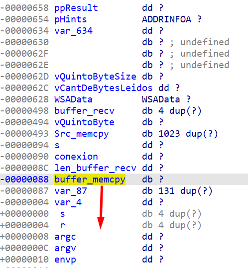**

Also, to overwrite the return address we would need 144 bytes, but the previous comparison with the maximum of 0x64 (100) would prevent this from happening.

**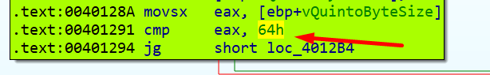**

One of the arguments of the **memcpy**() function is a size (**size_t**), that is, an unsigned integer, meaning it is always positive.

| void \*memcpy(void \*dest, const void \* src, size_t n) |
|---------------------------------------------------------|

The trick is in this line:

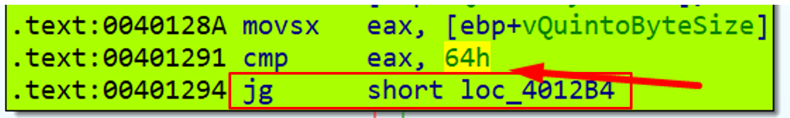

The **JG** (jump if greater) is a jump that considers the sign, and since it is a single byte, we would have that from 0 to 0x7F it is positive and from 0x80 to 0xff it is negative, so I can send a byte that is between 0x80 and 0xFF and for the program this value would be less than 0x64 since it is negative.

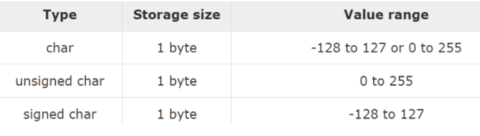

Note that the **memcpy** function will take this size as **positive**

Let's try to place a negative value as the fifth byte (anything greater than 0x7f), for example: 0x90, This would pass the comparison with 0x64 without problems and would go to memcpy to copy and overflow the stack.

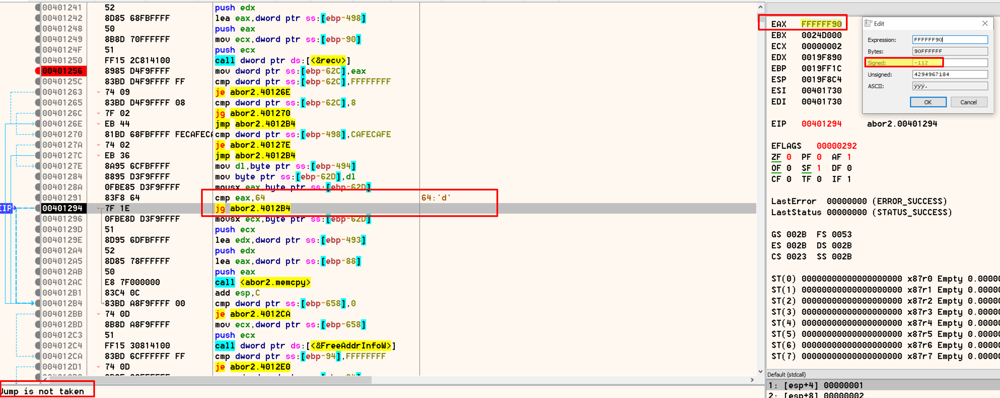

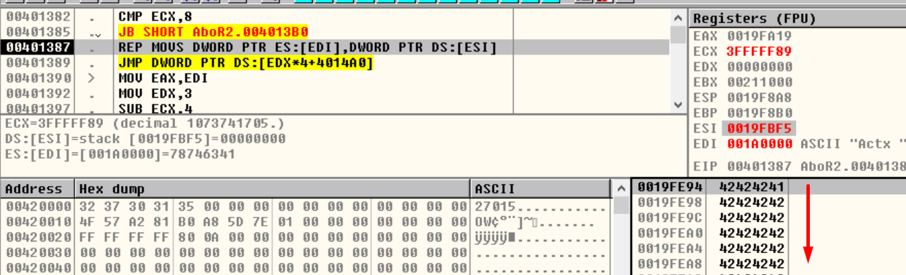

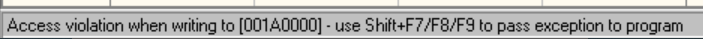

We have overflowed the entire stack and overwritten the **SHE**

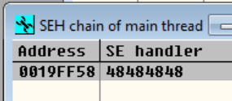

Now we just need to calculate the number of bytes needed to overwrite the SEH and overwrite it with some address with the instructions: pop, pop, ret to be able to jump to our shellcode.

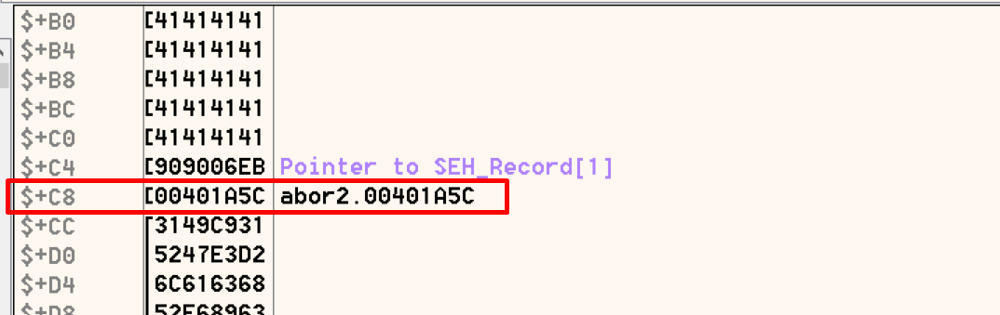

We need 0xc8 bytes but we have to take into account placing a jump just above so that when jumping to execute we can go over the SEH address. We would have to send 0xc4 + a jump 4 bytes further ahead and then the address of pop, pop, ret (401a5c)

**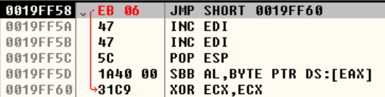**

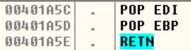

Then we would have the shellcode to run the calculator and we would also add a call to ExitProcess to end the program and prevent it from recursively returning to the SEH and running multiple calculators.

****

The script: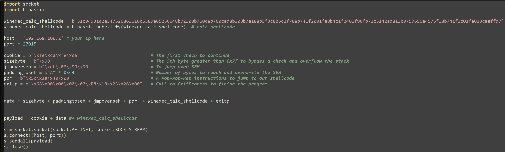

Referencias:

-   <https://www.tutorialspoint.com/c_standard_library/c_function_memcpy.htm>
-   <https://en.cppreference.com/w/c/types/size_t>
-   [JG (signed)](http://unixwiz.net/techtips/x86-jumps.html)
-   [size_t](https://www.informit.com/articles/article.aspx?p=686170&seqNum=6)
-   <https://blog.feabhas.com/2014/10/vulnerabilities-in-c-when-integers-go-bad/>
-   
