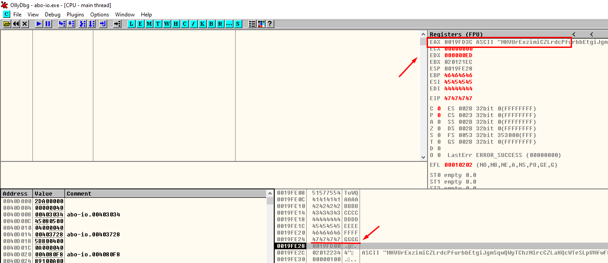

**abo-io.exe**

When we open this ABO in IDA we can see that it receives 2 arguments

The **sscanf()**  read formatted data from a string.

int sscanf(

const char \*buffer,

const char \*format [,

argument ]

In the main block we can see how the variables are represented in the stack.

Here **sscanf**() function reads input data from a buffer in this case argv1

The format of arg1 corresponds to unsigned integer (**%u**), with this we deduce that the first argument that we must pass is an integer

Then calculates the size of the second argument string (**argv2**)

After calculating the size of the second argument (argv2) perform the following operations:

**buffer + offset \* 4 + len(argv2)**

So, in order to reach \_**strcpy()**, the condition in the image above must be met, that is, the result of the operations performed just before must be **EAX** \<= to the value of **EDX**

When it reaches \_**strcpy()**, it will use **buffer+offset\*4** as destination buffer, remember that the buffer size is 255 bytes

If we look at the distance from the buffer variable to the return address, we can see that it is 268 bytes.

So we know that the destination address where memcpy will write comes from the result of **buffer + offset \* 4**

Since **offset** corresponds to the first argument which we control, we can also control the destination where the **memcpy()** function will copy.

compares if the final result exceeds the beginning of the next variable placed on the stack that follows it, in this case it is **un_byte**

Here we conclude on the importance of the length of the second argument (**argv[2]**)

On the other hand, the maximum size of the argv[2] string cannot exceed 255-4 which is the buffer size.

Taking this into account, we would not be able to reach the return address, we would be missing 12 bytes as seen in the image.

The solution in this case would be to send a negative value in the first argument (argv[1]) and a long string (up to 255) so that when the multiplication and addition are performed, the result is a smaller value that passes the comparison. The advantage is that we can control both the value of argv[1] and the string of argv[2] so that we can find the correct values ​​to be able to step on the return address.

Remember that the destination address of memcpy came from this formula:

**buffer + offset**(argv[1]**) \* 4**

Let's try these values:

Offset(argv[1]) = -**63** len(argv[2])= **255** ==\> Destination: 19FD3C

The result it’s a buffer overflow

We note that we control the ESI, EDI, EIP, EBP registers and eax points to the destination buffer of **strcpy()**

In ESP+4 is the address of argv2, so we can make it jump there to execute code, and thus have the entire shellcode complete.

We need to pop a value from the stack in order to jump to our code, so we look for a pop-ret

This is what our shellcode looks like in assembler

The script:

