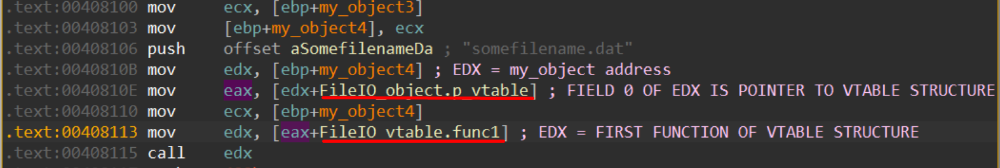

## Abo Use after free (abo-useafterfree.exe)

Let's reverse engineer this Abo to fully understand where the vulnerability is and how to exploit it.

For this we open it in IDA and begin to analyze the code and rename the variables as we identify them, and putting all the data that we discover.

In the **main()** function we can see that it will fill a buffer with the byte 0xff and then through new it creates an object, this new function is the equivalent of malloc, that is, it will reserve a space in memory of 0x10c for its object.

The variable **unk_411d20** is a global variable since it is located in the .DATA section

we are going to rename it to: buffer

Now we are going to create a structure of 0x10C that will be the one that corresponds to the object that is created using the operator new(uint) function and we will complete it as we move forward and see what each field is. For now we will call it **struct_1**

And we will name the variable **block** as **myobject** since it will store the address returned by the **NEW** function, which is where the object is located. After creating the object with **new**, simply verifies that the function was successful, and if so, it continues at **text:0x4080Df**.

By entering the **sub_4083A0** function, we see that it is the constructor of **FileIO**

Here I already have the function reversed, and we can see when it writes the pointer to the **vtable** in the first field of the **struct_1** structure, which we now know its correct name and can rename it and we will also change the type:

Now, by double-clicking on **vftable**, we will view the **vtable** and assign temporary names to the functions to identify them until we determine their real names. This is the **vtable** with the addresses of the corresponding functions:

We'll replace the addresses with names, like this:

Now we will create a structure for the **vtable**, select from the beginning to the end, right click create structure from selection

The structure is created:

So far then we have created a structure (**struct_1**) for the **FileIO** object and then another structure for the **vtable** of this object that will occupy the first field of struct_1

Now we are going to put names to the things we discovered.

**struct_40E458** to **FileIO_vtable**:

Now let's go to the structure of the object and change the type of the first field that corresponds to the pointer to the vtable, first rename it to **p_vtable** and then change the type:

In this way I am indicating that in **field 0** of my object (FileIO) there will be a pointer to another structure that corresponds to the **vtable**

We've already reversed until after the constructor, we've created and renamed the structures, then we have the following code:

The first thing I notice is that **my_object** starts storing it in different variables, so I'll start renaming what I can identify:

Now let's select the structures by pressing **T** in the places where it will be used, and the code looks like this:

Let’s see where **vtable.func1** will take us by double-clicking:

First it calls CreateFileA and then lstrcpynA, we can name it: **Create** since it will create a file named **somefile.dat** (the string that passes it as an argument.)

We can improve the **Call edx** a little so that it replaces the name of the register with that of the function we have discovered, we stand on the EDX CALL and press **Alt+F11** and we put the name of the function, in this way if we look for references of it, IDA now knows where it is called from.

 

We repeat these steps until the end of the block, it’ll look like this:

This way everything is much clearer, after calling the vtable functions (Create, Write and Close) it ends up calling **free()** to release the object.

In the next block it creates a new object of the same size, so the system instead of reserving a new space in memory will assign the same address that it has just released by **free(),** and then the program calls the **\_gets()** function whose argument is a buffer where it will store data that we control and ends up calling a function of the **vtable** that we can obviously manipulate.

The script

